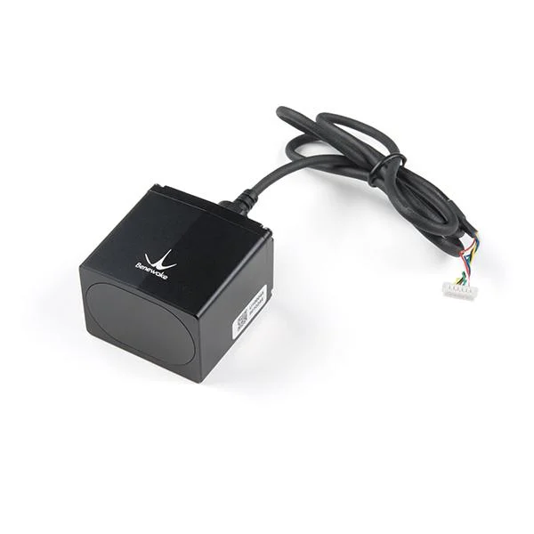
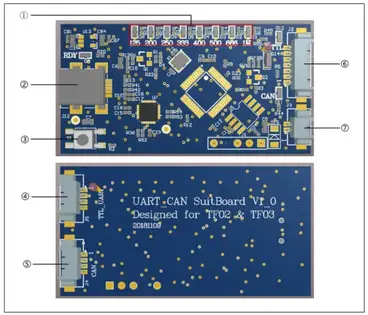
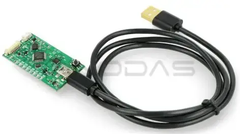

<p align="center"></p>
<h1 align="center"> Benewake TF03 LiDAR Testing UART </h1> 
<h4 align="right">February 24</h4>

<br>

Testing Benewake TF03-100/180 UART ```RPI UBUNTU 20.04```

## Benewake BP-UM-75-EN V00 Convertidor TTL / CAN a USB
<p align="center"></p>
<p align="center"></p>

## Librerias
```
sudo apt-get install python3-pip
pip3 install pyserial
pip3 install numpy
```

## Verificar puerto
```
ls -l /dev/ttyUSB*
Lsusb
```

> :bulb: **Tip:** Deberia encontrar
>```Silicon Labs CP2105 Dual UART Bridge```

## Cambiamos el puerto
```
ser.port = '/dev/ttyUSB1'
```
la interfaz utilizada esta vez es ```/dev/ttyUSB1```

## Ejecute el TestBenewake.py
```
sudo python3 test.py
```


<br>

# Code

### Librerias
```
sudo apt-get install python3-pip
pip3 install pyserial
pip3 install numpy
```

### TestBenewake.py

```
import serial.tools.list_ports
import time
import numpy as np

ser = serial.Serial()
ser.port = '/dev/ttyUSB1'
ser.baudrate = 115200

def getTFminiData():
    while True:
        count = ser.in_waiting
        if count > 8:
            recv = ser.read(9)
            #print('get data from serial port:',recv)
            ser.reset_input_buffer()
            if recv[0] == 0x59 and recv[1] == 0x59: #python3
                distance = np.int16(recv[2] + np.int16(recv[3]<<8))
                print('distance = %5d' % (distance))
                ser.reset_input_buffer()
        else:
            time.sleep(0.050) # 50ms

if __name__ == "__main__":
    try:
        if ser.is_open == False:
            try:
                ser.open()
            except:
                print('Open COM failed')
        getTFminiData()
    except KeyboardInterrupt: # Ctrl + C
        print('Interrupted, pressed ctrl-c button')
        if ser != None:
            ser.close()
```

info: <br>
https://en.benewake.com/TF03/index.html?gad_source=1&gclid=CjwKCAiA29auBhBxEiwAnKcSqpbF2R1T-UR7-fFptXnKBOAAdNK-RRkuTwOvUWm2hIEXhH2jhFhrRRoCBuIQAvD_BwE

https://manuals.plus/es/benewake/bp-um-75-en-v00-ttl-can-to-usb-converter-for-tf-lidar-manual

<br>

---
Copyright &copy; 2022 [carjavi](https://github.com/carjavi). <br>
```www.instintodigital.net``` <br>
carjavi@hotmail.com <br>
<p align="center">
    <a href="https://instintodigital.net/" target="_blank"></a>
</p>


